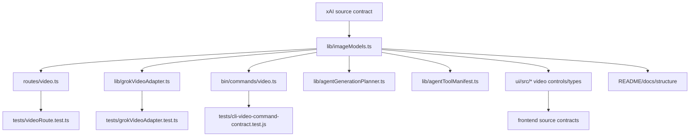

# Grok Video 1.5 1080p GUI/API Patch Plan

## Source contract

Primary evidence:

- xAI video generation docs: `grok-imagine-video-1.5` is a video model; `grok-imagine-video-1.5-preview` is a legacy alias.
- xAI model/pricing docs: `grok-imagine-video-1.5` exposes Image -> Video pricing, including 1080p.
- Existing project memory: 2026-06-01 live smoke treated 1.5 as I2V/frame-anchor-only; Ref2V/video references remain unsupported until a new smoke proves otherwise.
- 2026-06-29 progrok smoke listed `grok-imagine-video-1.5` from `/v1/models`.

Implementation contract:

- Canonical model name is `grok-imagine-video-1.5`.
- `grok-imagine-video-1.5-preview` remains accepted as an input/storage alias for backward compatibility, but is normalized before upstream requests.
- `1080p` is allowed only when the effective model is `grok-imagine-video-1.5` and the effective mode is `image-to-video`.
- `1080p` is rejected for base `grok-imagine-video`, prompt-only T2V, Ref2V/multi-image, video edit, and extension.
- Existing 480p/720p compatibility and existing 1.5 prompt-only white-canvas path remain unchanged for this patch; only 1080p is constrained to real I2V.

## User-visible result

The Video controls panel will show a 1080p resolution option. It is enabled only when the selected video model is Grok Video 1.5 and exactly one image/frame source is active. If the user switches away from that supported combination while 1080p is selected, the UI clamps the selection back to 720p before submission.

CLI/API/Agent callers can pass `1080p`, but server-side validation rejects unsupported combinations with a stable `INVALID_VIDEO_RESOLUTION` error instead of letting the request fail upstream.

## File change map

## Diff-level plan

### NEW

- `devlog/_plan/260629_grok-video-15-1080p/00_plan.md`
  - This plan and contract evidence.

### MODIFY: shared server contracts

- `lib/imageModels.ts`
  - Add canonical constants:
    - `GROK_VIDEO_MODEL_BASE = "grok-imagine-video"`
    - `GROK_VIDEO_MODEL_15 = "grok-imagine-video-1.5"`
    - `GROK_VIDEO_MODEL_15_PREVIEW_ALIAS = "grok-imagine-video-1.5-preview"`
  - Extend video model validation set to include canonical 1.5 and preview alias.
  - Normalize preview alias to canonical 1.5.
  - Extend `VideoResolution` to `"480p" | "720p" | "1080p"`.
  - Add a request-combination helper:
    - `validateVideoResolutionForRequest(model, resolution, mode)`
    - returns ok for 480p/720p.
    - returns `INVALID_VIDEO_RESOLUTION` unless `model === "grok-imagine-video-1.5" && resolution === "1080p" && mode === "image-to-video"`.

- `lib/grokVideoAdapter.ts`
  - Planner schema enum includes canonical 1.5 and `1080p`.
  - `buildVideoGenerationPayload` calls the request-combination helper.
  - 1.5 prompt-only canvas branch checks canonical 1.5.
  - fallback logs/tests move from preview name to canonical 1.5 while preview alias input still normalizes earlier.

- `routes/video.ts`
  - After resolving references and deriving `mode`, call `validateVideoResolutionForRequest`.
  - Reject unsupported 1080p before job creation/upstream calls.
  - Preserve metadata fields with canonical requested/effective model.

- `lib/capabilities.ts`
  - Expose supported models as base + canonical 1.5.
  - Expose resolutions as 480p/720p/1080p.
  - Add note that 1080p is 1.5 I2V-only.

### MODIFY: CLI/Agent contracts

- `bin/commands/video.ts`
  - Accept `1080p` in generate and continue validators/help.
  - Accept canonical 1.5 in `--model`; keep preview alias accepted.
  - Add CLI-side 1080p precheck for generate mode using `--ref` count.
  - Keep server as final authority for continue because frame extraction determines I2V at the server.

- `lib/agentTypes.ts`
  - Extend `AgentVideoParams.resolution` to include `1080p`.

- `lib/agentGenerationPlanner.ts`
  - Allow planner/manual parse of `1080p`.
  - Update regex and cleaning.

- `lib/agentPlannerModel.ts`
  - Update prompt enum text to include `1080p` and note it is 1.5 I2V-only.

- `lib/agentToolManifest.ts`
  - Add `1080p` to tool schema enum and description.

- `lib/agentImageVideoGen.ts`
  - Stop hardcoding every Agent video call to base `grok-imagine-video` when `1080p` is requested.
  - If Agent runtime has an actual source image (`mode === "image-to-video"`) and the selected resolution is `1080p`, send canonical `grok-imagine-video-1.5`.
  - If Agent asks for `1080p` without a source image, let the shared adapter validation reject the unsupported T2V combination with the same `INVALID_VIDEO_RESOLUTION` contract.
  - Extend `persistAgentVideo()` input metadata so sidecars no longer hardcode base `grok-imagine-video`; record `model`, `requestedModel`, `effectiveModel`, `modelFallback`, and nested `video.resolution` from `generateVideoViaGrok()` results.

### MODIFY: frontend UI

- `ui/src/types.ts`
  - Add canonical 1.5 model and 1080p resolution types.

- `ui/src/lib/imageModels.ts`
  - Use canonical 1.5 in video model options.
  - Keep preview alias accepted by `isVideoModelValue` for storage migration.
  - Add helpers:
    - `normalizeVideoModelValue`
    - `supportsVideoResolutionUI(model, resolution, mode)`

- `ui/src/store/storePersistence.ts`
  - Migrate stored preview alias to canonical 1.5.
  - Accept 1080p as a persisted resolution.

- `ui/src/store/storeSettingsImpl.ts`
  - Normalize selected video model before saving.

- `ui/src/components/PromptComposer.tsx`
  - Video toggle selects canonical 1.5.

- `ui/src/lib/continueFromItem.ts`
  - Continue-from-video default selects canonical 1.5.

- `ui/src/components/agent/agentTypes.ts`
  - Extend the frontend Agent video params resolution union to include `1080p`.

- `ui/src/components/VideoControlsPanel.tsx`
  - Add 1080p option.
  - Enable 1080p only for canonical 1.5 + effective image-to-video mode.
  - Effective image-to-video mode must account for plain refs, `providerUrlReference`, parent video frame refs, and continue-from-video/frame-anchor flows rather than only `activeVideoRefCount()`.
  - Auto-clamp unsupported selected 1080p back to 720p on model/ref-count changes.
  - Show short help copy instead of submitting an invalid state.

### MODIFY: documentation

- `README.md`
- `docs/README.ko.md`
- `docs/README.ja.md`
- `docs/README.zh-CN.md`
- `docs/API.md`
- `docs/CLI.md`
- `structure/02-command-reference.md`
- `structure/03-server-api.md`
- `structure/04-frontend-architecture.md`

Docs must state:

- canonical `grok-imagine-video-1.5`;
- preview alias accepted for compatibility;
- 1080p only for 1.5 single-image/frame I2V;
- 1.5 does not add Ref2V, V2V edit, or extension support.

### MODIFY: tests

- `tests/grokVideoAdapter.test.ts`
  - canonical 1.5 accepted, preview alias normalized.
  - 1.5 I2V 1080p payload allowed.
  - base/T2V/Ref2V 1080p payload rejected.

- `tests/videoRoute.test.ts`
  - route accepts 1.5 I2V 1080p through mock proxy.
  - route rejects base 1080p and 1.5 multi-image/Ref2V 1080p before upstream.

- `tests/cli-video-command-contract.test.js`
  - help documents 1080p and canonical 1.5.
  - generate CLI precheck rejects 1080p without exactly one `--ref`.

- `tests/agent-video-intent.test.ts`
  - parser accepts `1080p`.

- `tests/agent-mode-llm-planner-contract.test.ts`
  - Update the existing `cleanVideoParams(... resolution: "1080p" ...)` expectation from rejected to accepted.
  - Cover planner JSON preserving `1080p`.

- `tests/agent-mode-frontend-contract.test.js`
  - Cover the frontend Agent video params type/source contract if the existing source-regex contract reads that file; otherwise add an adjacent contract assertion.

- `tests/agent-mode-runtime-contract.test.ts`
  - Add/extend an Agent video generation test so `resolution: "1080p"` with a source image sends canonical `grok-imagine-video-1.5` to `generateVideoViaGrok`.
  - Assert the persisted Agent video sidecar stores `model/requestedModel/effectiveModel/modelFallback` and nested `video.resolution` from the actual generation result.

- `tests/cli-capabilities-contract.test.js`
  - capability source includes 1080p and canonical 1.5.

## Verification plan

Targeted checks:

- `node --test --import tsx tests/grokVideoAdapter.test.ts`
- `node --test --import tsx tests/videoRoute.test.ts`
- `node --test tests/cli-video-command-contract.test.js`
- `node --test --import tsx tests/agent-video-intent.test.ts`
- `node --test --import tsx tests/agent-mode-llm-planner-contract.test.ts`
- `node --test tests/agent-mode-frontend-contract.test.js`
- `node --test --import tsx tests/agent-mode-runtime-contract.test.ts`
- `node --test tests/cli-capabilities-contract.test.js`

Build/static checks:

- `npm run typecheck`
- `npm run typecheck:tests`
- `npm run ui:build`
- `npm run build:server`
- `npm run build:cli`

Runtime smoke:

- Use current progrok login/proxy only for a non-generating server smoke:
  - `/api/grok/status` lists canonical `grok-imagine-video-1.5`.
  - No live paid 1080p generation unless Jun explicitly asks for paid generation.

## Risks

- Existing metadata/tests use `grok-imagine-video-1.5-preview`; canonical normalization changes visible `requestedModel` values for alias inputs.
- UI ref-count can differ between Classic/Node/continue flows, so server validation remains authoritative.
- Agent Mode has no explicit model selector for video; it can parse 1080p but cannot guarantee the 1.5 I2V condition without current-image context. Server rejection is expected for unsupported agent calls.
